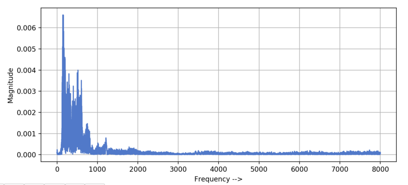

# Documentation

## Understanding audio data and spectrogram features

The first thing I need to do is understandig how to manipulate audio data. Basically there are two main ways to build a simple NN to work with audio:

1. You can build it using 1d convolutional layers on the raw audio track;
2. You can build it using 2d convolutional layers on the spectrogram of the track. 

The second way is interesting because it reduces the problem to some kind of image classification, and that's why I chose it. I got some knowledge on signal processing from my achademic background (FT, DFT, FFT...), so I can dive into what I need.

In audio processing, it's common to use `.wav` audio codec, which is losssless (without compression at all). Every Python audio library gives you some metadata about the recording, such as the sampling rate, how many captures per second you have. The duration of the track can be obtained dividing the length of the sample by the samplinge rate. Since audio is an array of amplitudes, we can plot it in the time domain. 

When you plot the audio, you get some knowledge about the loudness of the audio recording, but to understand it you need to transform it in the frequency domain. 

We can make this transformation by using the FFT algorithm. Usually, human speech has the main frequency components between $0$ and $1kHz$.

The frequency domain gives us information about the frequencies of the track, but anything about the time of it, so that if we have a sentence we can't say which word comes first. A spectrogram is a _visual represenation of frequencies of a given signal with time_. One axis represents time, the second one frequency, while the color of each point is the aplitude of the observed frequency at a particular time. 

Usually, we need to break the audio signal into smaller frames (windows) and calculate DFT for each windows. Windows are in order and overlapped, so that we won't lose any frequency. For a typical speech recognition task, the window's size is between $20$ and $30ms$ (humans can't speak more than one phoneme in this windows, so that we can recognize all of them). 

References: [[1](https://towardsdatascience.com/understanding-audio-data-fourier-transform-fft-spectrogram-and-speech-recognition-a4072d228520)], [[2](https://en.wikipedia.org/wiki/WAV)].