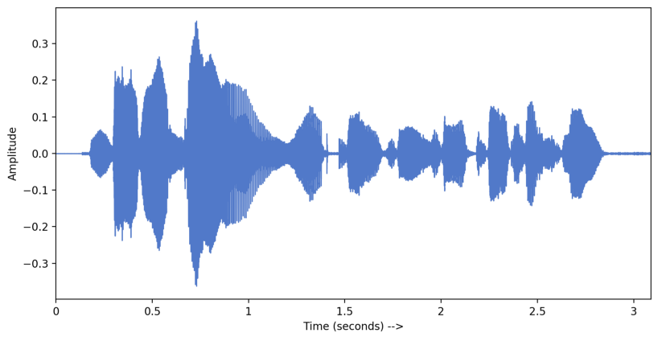
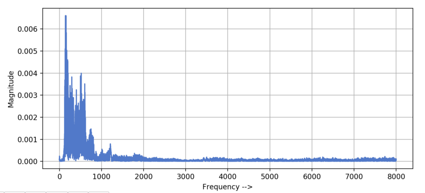
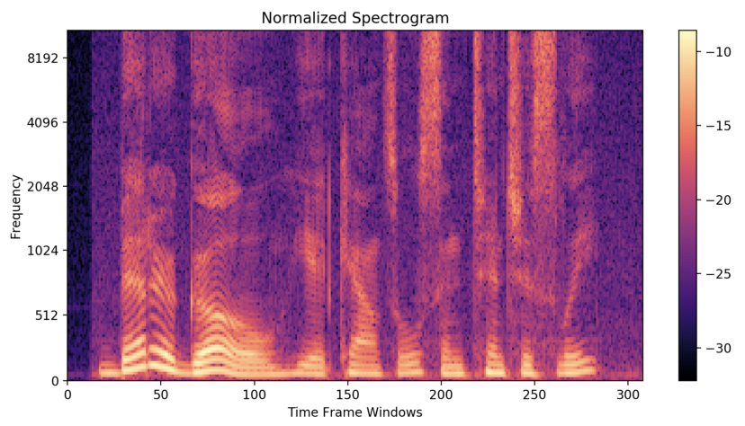

## Understanding audio data and spectrogram features

Since my work will be related to waveforms and audio track, I decided to read something about it. 

In audio processing, it's common to use `.wav` audio codec, which is lossless (without compression at all). Each Python audio library gives you some metadata about the recording, such as the sampling rate, that is how many captures per second you have. The duration of the track can be obtained dividing the length of the sample by the samplinge rate. Since audio is an array of amplitudes, we can plot it in the time domain. 

When you plot the audio, you get some knowledge about the loudness of the audio recording, but to understand it you need to transform it in the frequency domain. 

We can make this transformation by using the FFT algorithm. Usually, human speech has the main frequency components between $0$ and $1\text{KhZ}$.

The frequency domain gives us information about the frequencies of the track, but nothing about the time, so that if we have a sentence we can't say which word comes first. A spectrogram is a _visual represenation of frequencies of a given signal with time_. One axis represents time, the second one frequency, while the color of each point is the aplitude of the observed frequency at a particular time. 

Usually, we need to break the audio signal into smaller frames (windows) and calculate DFT for each windows. Windows are in order and overlapped, so that we won't lose any frequency. For a typical speech recognition task, the window's size is between $20\text{ms}$ and $30\text{ms}$ (humans can't speak more than one phoneme in this windows, so that we can recognize all of them). 

A spectrogram shows frequencies in linear scale but our ear can discriminate lower frequencies more than higher frequencies. So, we transform the spectrogram’s amplitudes from linear scale to Mel scale. Mel scale aims to mimic the non-linear human ear perception of sound. The resultant spectrogram is called Mel Spectrogram. The conversion into the mel scale is performed using mel filters. Frequencies on the linear scale are multiplied with mel filters to get frequencies on the mel scale.

We also perceive loudness on a logarithmic scale. So, we transform amplitude into the decibel scale, getting the melscale.

There are two main ways to build a simple NN to work with audio:

1. You can build it using 1d convolutional layers on the raw audio track;
2. You can build it using 2d convolutional layers on the spectrogram of the track. 

The second one is interesting as it makes the neural network more explainable (dealing with images is always better for explainability), but some resources [[4](https://arxiv.org/abs/1610.00087)] demonstrate that deep neural networks with many convolutional layers can outperform networks based on log-mel scale.

References: [[1](https://towardsdatascience.com/understanding-audio-data-fourier-transform-fft-spectrogram-and-speech-recognition-a4072d228520)], [[2](https://en.wikipedia.org/wiki/WAV)], [[3](https://medium.com/@hasithsura/audio-classification-d37a82d6715)], [[4](https://arxiv.org/abs/1610.00087)]