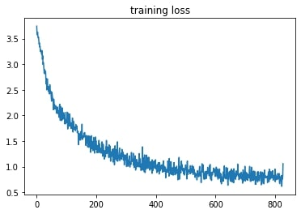

## Results

Here is a plot of the loss function decreasing after two epochs: 

The accuracy of the network is $71\%$. This result is not excellent, but we need to consider some limitations of the work:

- We haven't used any particular technique to make the network _stronger_. We have many layers inside it, and, as we know, there may be many problems related to gradient descent.
- Some words may be similar to each other, making harder for the network to guess them. 

Since the labels were 35, a random guess on the label has $2.86\%$ of probability to be correct. As our percentage is way higher, we can say our network works properly. 