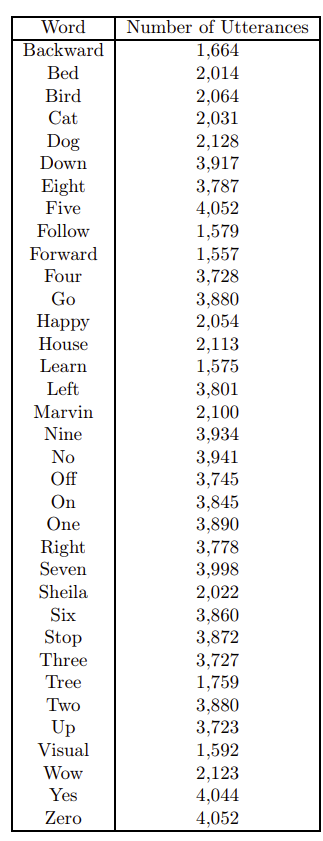

## Dataset 

The dataset I've found is [this](https://arxiv.org/abs/1804.03209). It consits in some basic english words repeated thousands of times. Here is the list of words, followed by their number of occurances. 



The advantage of using an already built dataset is obvious: words pronunciation are different from each other, there are many kind of data augmentation in it (for instance, some background noise) and useful API to start working on it.

Here is a snippet of the code to work with the dataset:

```python
from torchaudio.datasets import SPEECHCOMMANDS
import os


class SubsetSC(SPEECHCOMMANDS):
    def __init__(self, subset: str = None):
        super().__init__("./", download=True)

        def load_list(filename):
            filepath = os.path.join(self._path, filename)
            with open(filepath) as fileobj:
                return [os.path.normpath(os.path.join(self._path, line.strip())) for line in fileobj]

        if subset == "validation":
            self._walker = load_list("validation_list.txt")
        elif subset == "testing":
            self._walker = load_list("testing_list.txt")
        elif subset == "training":
            excludes = load_list("validation_list.txt") + load_list("testing_list.txt")
            excludes = set(excludes)
            self._walker = [w for w in self._walker if w not in excludes]


# We don't need the validation!
train_set = SubsetSC("training")
test_set = SubsetSC("testing")
```

Each element has some information about the track. For instance, you get the waveform (which you can plot using `matplotlib`), the sample_rate (16KhZ), the lables (which word is pronunced) and some ids for the speaker and for the track into the dataset. 

There are some basics transformation we can apply to facilitate the training:
- We can downsample the audio for faster processing, for instance from 16KHz to 8KHz. In this case we are loosing some information about the audio, but it's still good enough to analyze it;
- We can reduce the number of channels, if there are more than one. All the tracks in this case are single channels; otherwise, we could mix the channels through an average, or simply delete one of them. 

```python
new_sample_rate = 8000
transform = torchaudio.transforms.Resample(orig_freq=sample_rate, 
										   new_freq =new_sample_rate)
```

Since each words needs an id, we can use its position inside an array made of the sorted words. This is done defining the array `labels`, and the two simple functions `label_to_index` and `index_to_label`.

Then we can create the two loaders using the DataLoader class in `torch.utils.data`.

References: [[1](https://arxiv.org/pdf/1804.03209.pdf)], [[2](https://pytorch.org/tutorials/intermediate/speech_command_classification_with_torchaudio_tutorial.html)]